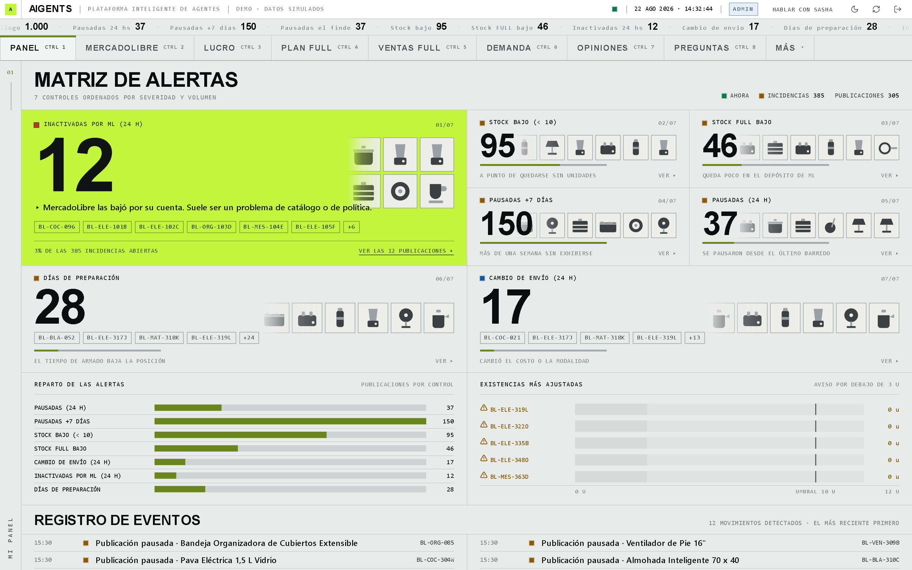
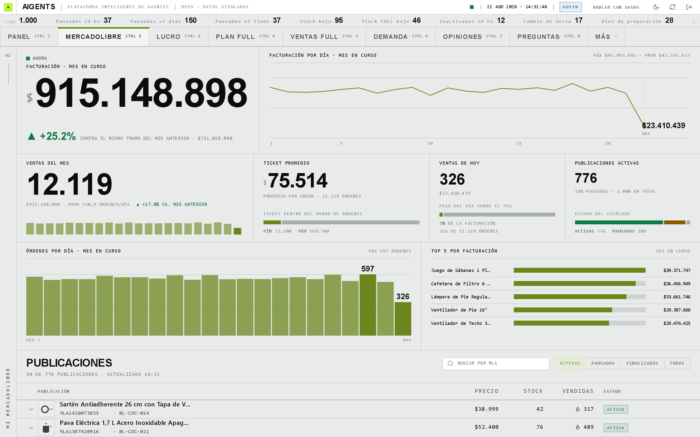
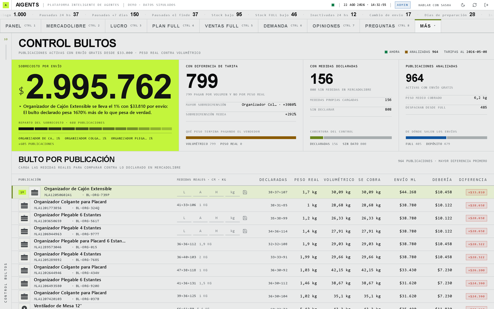
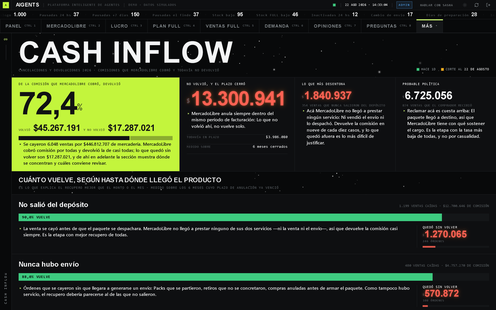
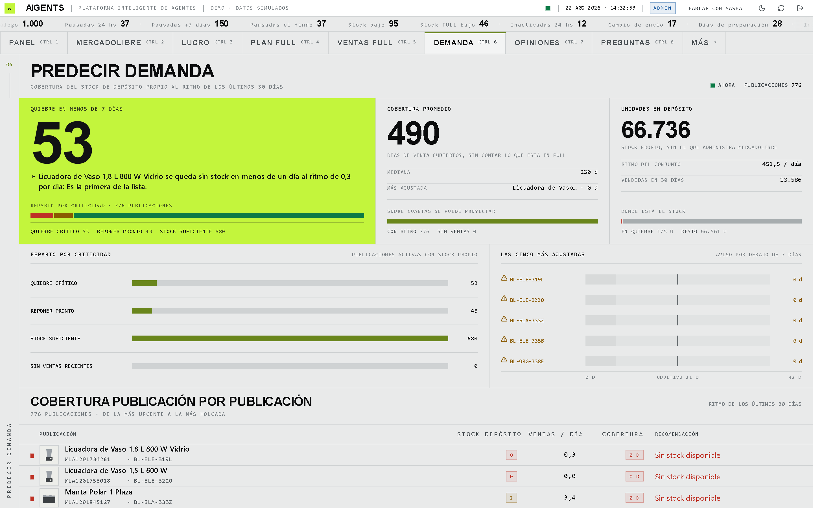
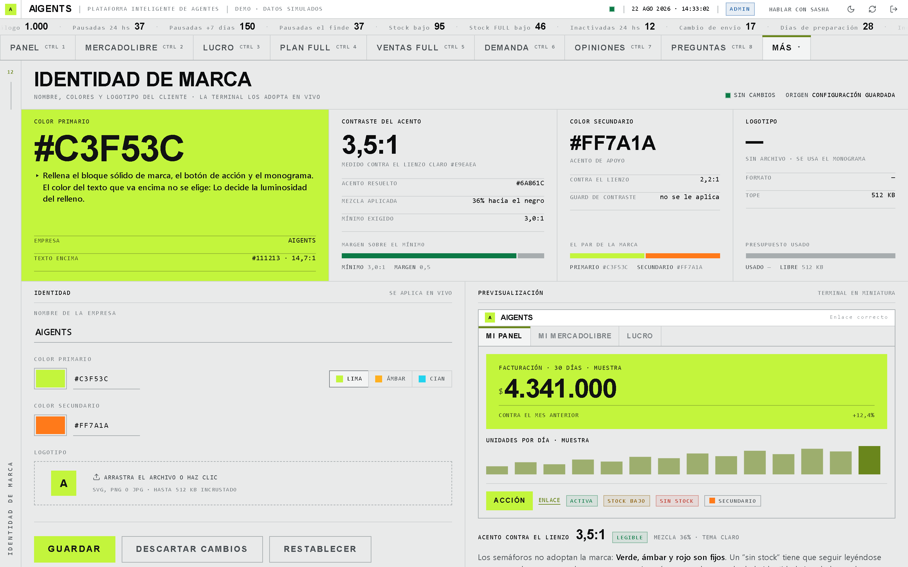
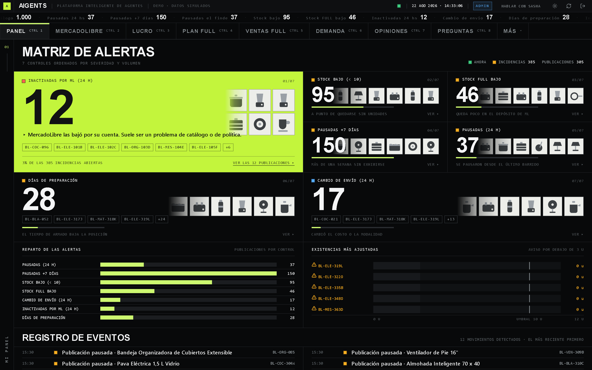

# AIGENTS — Demo interactiva

**Agentes que conocen tu negocio de MercadoLibre, avisan a tiempo y sugieren mejoras.**

Este repositorio publica una demostración navegable de AIGENTS. Es la aplicación real, con un catálogo de ejemplo en lugar de una cuenta.

### ▶ **[Abrir la demo en el navegador →](https://cristianzbt.github.io/AIGENTS-DEMO-CODE/)**

No pide registro ni instala nada: Entra directo al panel. Todos los números son inventados y la cinta superior lo dice en todo momento. Si quieres ver la pantalla de acceso, agrega `?acceso=1` al final de la dirección.

**Es la aplicación completa, no una maqueta.** El mismo frontend que corre en producción —los mismos módulos, el mismo armazón, el mismo motor de marca— con la capa de datos reemplazada por un catálogo en memoria. Las doce secciones se navegan de verdad: Pestañas, atajos de teclado, orden y filtrado de tablas, paginación, fichas de detalle, cambio de tema y edición de la identidad visual. Las escrituras también funcionan: Pausar una publicación baja el contador de activas en la cinta de arriba, y Lucro Cesante empieza a cobrarte esa pausa.

---

## Qué resuelve

La diferencia con el panel oficial de MercadoLibre no es que muestre otros datos: Es que **los cruza**.

MercadoLibre dice que una publicación está pausada, pero no cuándo dejó de venderse ni cuánto facturaba antes. Dice cuánto stock hay, pero no si eso alcanza para dos semanas al ritmo actual. Cobra un envío, pero no avisa que lo está calculando por peso volumétrico en vez de por el peso real.

AIGENTS guarda su propia foto del catálogo en cada barrido, y de ahí saca los «cuándo» y los «cuánto» que la API no entrega. Eso es lo que después le permite a un agente avisar a tiempo en vez de solo informar.

## Las doce secciones

| Sección | Qué muestra |
|---|---|
| **Mi Panel** | Matriz de alertas por severidad: Pausadas en 24 h, pausadas hace más de 7 días, pausadas durante el fin de semana (solo los lunes), stock bajo, stock FULL bajo, cambio de envío, inactivadas por MercadoLibre y días de preparación. Cada alerta se marca como revisada. |
| **Mi MercadoLibre** | Facturación del mes contra el mismo tramo del anterior, ticket promedio, visitas, y la tabla de publicaciones con las acciones de escritura: Pausar, activar y cambiar precio con vista previa. |
| **Lucro Cesante** | Publicaciones pausadas que venían vendiendo: Cuánto se deja de facturar por día y cuánto se acumuló desde la pausa. |
| **Plan FULL Semanal** | Cuántas unidades mandar al depósito esta semana, producto por producto, para cubrir 14 días al ritmo de los últimos 30. Con casilla de «ya cargado» que se reinicia sola los lunes. |
| **Ventas FULL** | Qué se vendió despachado desde el depósito de MercadoLibre en 15, 30 o 60 días, con el stock que queda y exportación a planilla. |
| **Predecir Demanda** | Cuántos días de venta cubre el stock propio de cada publicación activa, y qué conviene reponer primero. |
| **Control Bultos** | Dónde MercadoLibre cobra el envío por peso volumétrico en vez del real, cuánto cuesta esa diferencia y qué medida habría que corregir. |
| **Competencia** | Los productos que se eligió vigilar, con hasta cuatro competidores cada uno: Quién está más barato y por cuánto. |
| **Opiniones** | Qué dicen los compradores de lo vendido en los últimos 60 días, con tres lentes: Calificación baja, negativas recientes y mejor valoradas. |
| **Preguntas** | De qué preguntan los compradores agrupado por tema, qué publicaciones generan más dudas por venta y cuáles venden sin recibir ninguna. |
| **Cash Inflow** | Cuánta comisión cobró MercadoLibre por ventas que después se cayeron, y cuánta de esa plata no devolvió. Con la inversión y la facturación de Product Ads mes a mes. |
| **Identidad de marca** | Nombre, logotipo y colores de la empresa, con detección automática de los colores del logotipo y lectura del contraste resultante. |

### Cash Inflow: La plata que ya te cobraron

Mide cuánta comisión cobró MercadoLibre por ventas que después se cayeron, y cuánta de esa plata no devolvió. Está ordenada por el hallazgo que la explica, que no es el que uno esperaría: **Lo que vuelve no depende del monto ni del mes, sino de hasta dónde llegó el producto.** Si la venta ni se despachó, MercadoLibre devuelve la comisión nueve de cada diez veces; si el comprador llegó a recibirla, poco más de la mitad. Ese gradiente es lo que separa la plata que conviene reclamar de la que probablemente sea criterio de MercadoLibre y no un olvido. Incluye también la inversión y la facturación de Product Ads mes a mes.

Es la única sección que existe sólo en oscuro, y el panel cambia de tema al entrar: Se lee sobre un cielo con estrellas, y lo que ya venció el plazo se muestra en llamas porque no vuelve solo. En la barra está detrás de «Más», o directo con **Ctrl+9**.

**Sobre la columna «Comprador».** En una cuenta real cada fila lleva el apodo de quien compró, y eso no puede viajar a un repositorio público. Acá va anonimizado por construcción —`COMPRADOR-9510`—, que no es el apodo de nadie ni se parece a uno: Preferimos un identificador evidentemente sintético antes que inventar nombres verosímiles. Todo lo demás de la sección funciona igual que en producción.

---

## Los Agentes escriben en la pantalla, no sólo en el chat

Sasha es la voz, pero no es el único lugar donde los Agentes hablan. **Cada frase que empieza con «▸» es la lectura de un Agente sobre los datos que están justo arriba**, redactada en el momento a partir de esos números — no es un texto de ayuda escrito de antemano ni una descripción de la sección.

> ▸ El 30% de las ventas se cae el mismo día en que se vendió: El comprador se arrepiente antes de que salga el paquete.

La diferencia con un rótulo es que el rótulo dice *qué* es el número y el Agente dice *qué significa*, incluso cuando incomoda: Por qué una columna está vacía y no en cero, qué mes todavía no se puede saber, cuál de dos cifras parecidas es la que conviene mirar primero. Si los datos cambian, la frase cambia; si no hay nada que señalar, no aparece.

Están repartidas por todo el panel, así que se cruzan navegando la demo. Es la misma idea que sostiene a Sasha —no informar, sino decir qué hacer con lo informado— puesta donde el operador ya está mirando.

---

## Sasha, la agente de voz

Sasha es con quien se habla —en voz— sobre los datos de la propia cuenta. Se le pregunta cómo viene el mes contra el anterior, qué se está por quedar sin stock o cuánto se pierde por las pausadas, y contesta con los mismos números que muestran las secciones.

- **Voz a voz, sin pasos intermedios de texto.** Corre sobre Gemini Live con audio nativo. Mientras habla, una cinta de espectro muestra el sonido real de su voz y la banda dice qué está haciendo: Escuchando, hablando o consultando un dato.
- **Veintiuna herramientas de solo lectura.** Leen de donde ya lee el panel, sin una segunda implementación de nada. No inventa números: Si no tiene el dato, lo dice.
- **Ve lo que hay en pantalla, literalmente.** Lo que recibe mientras dura la charla se extrae del panel ya dibujado: Los mismos rótulos, las mismas cifras con el mismo formato y el mismo «hace 8m» que tienes delante. No rehace las cuentas por su lado, así que no puede decirte un número distinto del que estás mirando. Si lo que preguntas ya está a la vista contesta al instante; si no está, usa la herramienta, y si el dato guardado tiene más de una hora se va a buscarlo en vivo y te explica por qué tardó.
- **No dice un dato que ninguna fuente le dio.** En su prompt no hay un solo ejemplo con productos, montos ni cantidades — ni siquiera para ilustrar el formato de una búsqueda. Es una regla verificada por pruebas, no una intención: Un ejemplo con datos es material que el modelo puede recitar como si fuera del catálogo de quien pregunta.
- **La clave de la API nunca sale del servidor.** El navegador recibe un token efímero de un solo uso, con el prompt, la voz y las herramientas ya embebidos, así que nada de eso se puede alterar desde el cliente.
- **Memoria opcional y administrable.** Recuerda lo que se le contó entre conversaciones. A un recuerdo se le puede poner fecha —«avisame el 25 que vence el contrato del depósito»— y ese día llega por Telegram a las ocho de la mañana y aparece al abrir la charla. Todo lo guardado se revisa y se borra desde el panel, y la memoria entera se apaga por usuario.
- **También por Telegram.** La misma agente, en texto, en el bot de la empresa: Alertas cuando aparece algo nuevo, un resumen cada mañana hábil y chat directo.

> En esta demo Sasha aparece como botón, pero no habla: El motor de voz no viaja en la demostración, y es la única parte del panel que no se puede probar acá. Lo que sí se puede ver es exactamente lo que ella ve — y eso es más literal de lo que parece. Cada cifra que se lee en esta pantalla es la misma cadena de texto que Sasha recibe en producción, copiada del panel dibujado y no recalculada por su cuenta: El rótulo, el número ya formateado y el «hace 8m» de cada sección. En producción nadie tiene que explicarle en qué pantalla está parado ni qué números tiene delante, porque tiene los mismos. Por eso contesta en el acto lo que está a la vista, y se guarda la consulta lenta para lo que no lo está.

### Qué sugiere, y por qué

Cuando se le pide una recomendación, Sasha no improvisa: Hay un motor **determinista, sin modelo de lenguaje**, que arma hasta cinco sugerencias a partir de cuatro fuentes. Que sea determinista es el punto — la misma foto de la cuenta da siempre la misma sugerencia, y se puede auditar por qué.

| De dónde sale | Qué sugiere |
|---|---|
| Lucro cesante | «Está pausada y se estima que perdés unos $X por mes: Reactivala.» |
| Control de bultos | «El envío gratis le cuesta $X de más en cada venta: Revisá las dimensiones cargadas.» |
| Predicción de demanda | «Reponé stock antes de unos N días o se corta la venta.» |
| Alertas del panel | «N publicaciones pausadas hace más de 7 días: Revisalas y decidí.» |

Las reglas de prioridad son las que hacen que la primera sugerencia sea la que importa:

1. **El dinero manda.** Una sugerencia con monto menor nunca desplaza a una con monto mayor, vengan de donde vengan. Sin esa regla, cinco publicaciones pausadas perdiendo cientos de miles por mes podían quedar tapadas por un sobrecosto de envío de novecientos pesos, solo porque venían de fuentes distintas.
2. **Una plaza reservada para lo urgente sin precio.** Un quiebre de stock inminente no tiene monto en la foto, e inventarlo sería mentir — así que se le garantiza un lugar, pero nunca más de uno.
3. **Las unidades no se mezclan.** Lo que se pierde *por mes* y lo que cuesta *por envío* no se pueden comparar sin inventar un dato, y el sistema lo dice en vez de disimularlo.
4. **Los días se recalculan contra ahora**, no se copian de la foto anterior.

Y cuando contesta, cuenta **la primera** —la que más dinero mueve de lo que se pudo medir— en vez de recitar la lista entera.

### Veintiséis preguntas para hacerle

Cada una tiene detrás una herramienta que la responde con datos de la cuenta:

1. ¿Cómo viene mi cuenta? ¿Cuántas publicaciones tengo activas y cuántas pausadas?
2. ¿Cuánto facturé este mes?
3. ¿Cómo vengo comparado con el mes pasado?
4. ¿Cómo vinieron las ventas los últimos quince días?
5. ¿Qué día de la última semana vendí más?
6. ¿Cuáles son mis cinco publicaciones que más facturan?
7. ¿Y las que más unidades venden?
8. Buscame la publicación del [producto].
9. ¿A qué precio está y cuánto stock le queda?
10. ¿Cuántas visitas tuvo esa publicación? ¿Viene subiendo o bajando?
11. ¿Hay algo de la cuenta que tenga que atender hoy?
12. ¿Cuánta plata estoy perdiendo por las publicaciones pausadas?
13. ¿Qué pausada me conviene reactivar primero?
14. ¿Qué se me está por quedar sin stock?
15. ¿Para cuántos días me alcanza el stock del [producto]?
16. ¿Estoy pagando envíos de más por el tamaño del bulto?
17. ¿Cómo vienen las ventas por FULL?
18. ¿Quedaron preguntas de compradores sin responder?
19. ¿Cómo viene mi reputación? ¿Hubo opiniones negativas hace poco?
20. ¿Qué dicen las opiniones de esa publicación? Leeme la última.
21. ¿Qué me están preguntando en esa publicación?
22. ¿Hay algún competidor más barato que yo?
23. ¿En cuál me estoy quedando más caro, y por cuánto?
24. ¿Cuánto tengo que mandar a FULL esta semana, y de qué?
25. ¿Cuánta plata quedó trabada en comisiones de ventas que se cayeron?
26. ¿Qué harías vos para mejorar el negocio este mes?

Y dos que no son preguntas: **«acordate de que en noviembre lanzo una línea nueva»**, que queda guardado como dato permanente del negocio, y **«recordame el 25 que tengo que llamar al proveedor»**, que además se cobra solo ese día. El pedido es el permiso: No hay que confirmar nada, y todo lo guardado queda listado en el panel para revisarlo o borrarlo.

---

## Por qué esto y no una planilla

- **Cruza lo que la API no cruza.** Es la razón de existir: Los «cuándo» y los «cuánto» salen de la propia foto histórica, no de MercadoLibre.
- **Las sugerencias son explicables.** Determinismo en vez de un modelo opinando: Se puede reproducir y discutir cada una.
- **Cada empresa, su propia base.** No hay una base central con los datos de todos: Cada instalación se conecta a su propio proyecto de Supabase y a su propia aplicación de MercadoLibre. El bot de Telegram también es el bot de la empresa, creado con su token.
- **White-label de verdad.** Nombre, logotipo y colores se cargan desde el panel y toda la interfaz los adopta, con un guard de contraste que garantiza que el color elegido siga siendo legible en tema claro y oscuro. Los semáforos nunca adoptan la marca: «sin stock» tiene que seguir leyéndose como alarma aunque la empresa sea roja.
- **Tema claro y oscuro** como ciudadanos de primera clase, con paleta completa y semáforos recalibrados en cada uno.
- **Todo exportable** a `.xlsx`, más un muelle de reportes con cinco planillas armadas.
- **Preparado para otros países de MercadoLibre**: Argentina, Brasil y México, con su moneda, su huso horario y sus tarifas de envío.

---

## Hacia dónde va

Hoy AIGENTS opera sobre MercadoLibre. La arquitectura, sin embargo, no está atada a ese canal por diseño sino por implementación, y eso es lo que hace realista extenderla:

- El navegador nunca habla con MercadoLibre: Manda una **acción con nombre** a una función en el borde y recibe datos ya procesados. Un canal nuevo es una función hermana que responde el mismo contrato, sin tocar la interfaz.
- El motor de sugerencias es un **módulo puro** que no sabe de dónde salieron los datos: Consume fotos normalizadas del negocio. Cualquier canal que escriba esas fotos con la misma forma reusa las sugerencias y el resumen diario tal cual están.

Sobre esa base, en el plan de producto:

- **WooCommerce** y **API de Tienda Nube**, para vendedores que ya operan su propia tienda además del marketplace.
- **Integraciones a medida** contra las APIs que el cliente ya tenga: Su ERP, su sistema de stock, su logística.

Son desarrollos por hacer, no funcionalidades disponibles hoy. Si tienes un caso concreto, es la mejor forma de definir cuál va primero.

---

## Qué es esta demo, y qué no

**Es**: La aplicación real, concatenada y minificada, corriendo sobre un catálogo de ejemplo coherente —si la cinta dice cinco pausadas, hay cinco publicaciones pausadas, y Lucro Cesante cobra por esas mismas—. Las escrituras mutan el catálogo de verdad, y hay latencia simulada para que se vean los estados de carga.

**No es**: No incluye el backend, ni el esquema de datos, ni el código fuente del producto, ni la voz de Sasha. Los datos son inventados: No hay ninguna cuenta real detrás.

AIGENTS es software propietario. Ver [LICENSE](LICENSE).

---

## Contacto

**Cristian Zubieta** — cristianzbt@gmail.com

Para una demostración con tus propios datos, escríbeme.
